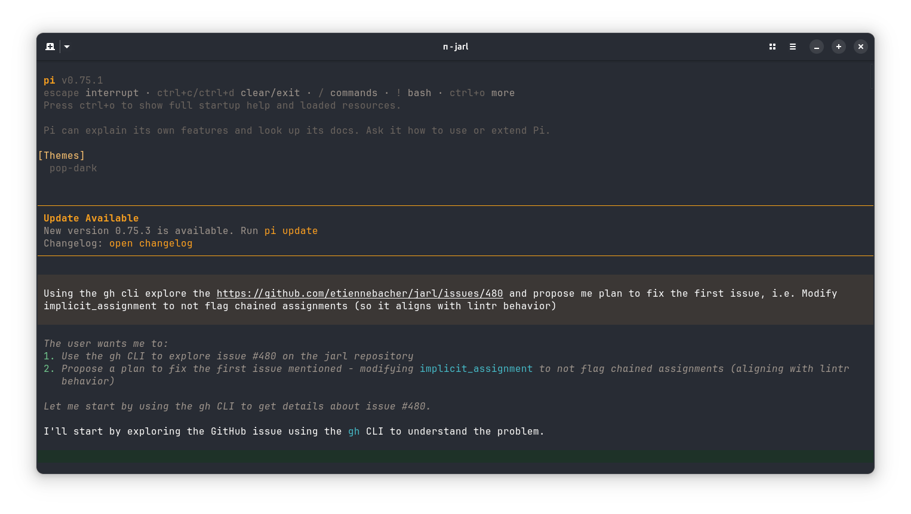
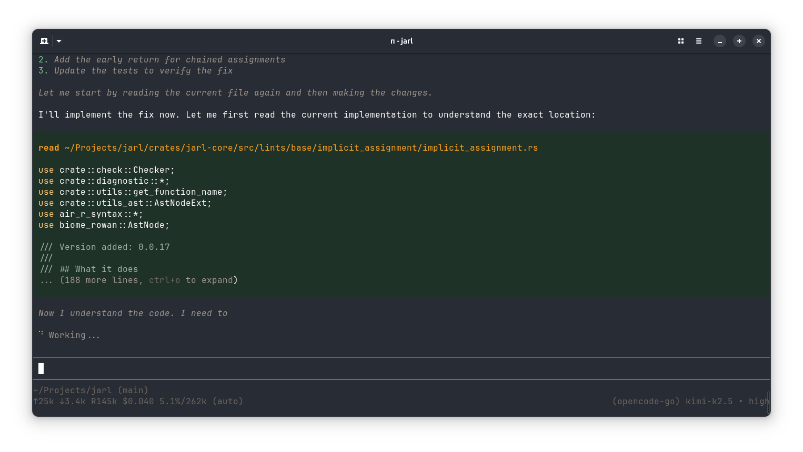

# Pop Theme for Pi Coding Agent

A port of the Pop!_OS design language for the [Pi Agent Harness](https://github.com/earendil-works/pi).

## About

This theme brings the warm browns, electrifying teals, and scintillating tangerines of System76's Pop!_OS to Pi. It is based on the color scheme originally ported to VS Code by [ArtisanByteCrafter](https://github.com/ArtisanByteCrafter/VSCodePopTheme) and the Zed theme by Anatoly Tsyplenkov.

## Gallery
#### `01` Pop Dark

<p align="center">
    
</p>
<p align="center">
    
</p>

#### `02` Pop Light

**TBA**

## Installation

### From GitHub Releases (recommended)

1. Go to the [**Releases**](https://github.com/atsyplenkov/pi-pop-theme/releases) page
2. Download `pop-dark.json` from the latest release
3. Copy it to Pi's themes directory:
   ```bash
   mkdir -p ~/.pi/agent/themes
   cp ~/Downloads/pop-dark.json ~/.pi/agent/themes/
   ```
4. Select the theme in Pi via `/settings` or add to `settings.json`:
   ```json
   {
     "theme": "pop-dark"
   }
   ```

### Development (symlink)

If you want to modify the theme:

```bash
git clone https://github.com/atsyplenkov/pi-pop-theme.git
cd pi-pop-theme
ln -sf "$(pwd)/themes/pop-dark.json" ~/.pi/agent/themes/pop-dark.json
```

Changes to the file will hot-reload in Pi via `/reload`.

## See also

* [**VS Code Pop Theme**](https://github.com/ArtisanByteCrafter/VSCodePopTheme) — The original VS Code port by [@ArtisanByteCrafter](https://github.com/ArtisanByteCrafter)
* [**Zed Pop Theme**](https://github.com/atsyplenkov/zed-pop-theme) — The  Zed editor port (this theme's parent)

## Acknowledgements

- [**@ArtisanByteCrafter**](https://github.com/ArtisanByteCrafter/VSCodePopTheme) — The original VS Code port of the Pop!_OS theme
- [System76](https://system76.com/) — Creators of Pop!_OS and the original design language
- This project has made use of AI-assisted pair programming using `Kimi-K2.5` and `Pi`

## License

MIT License. See [LICENSE](./LICENSE).
